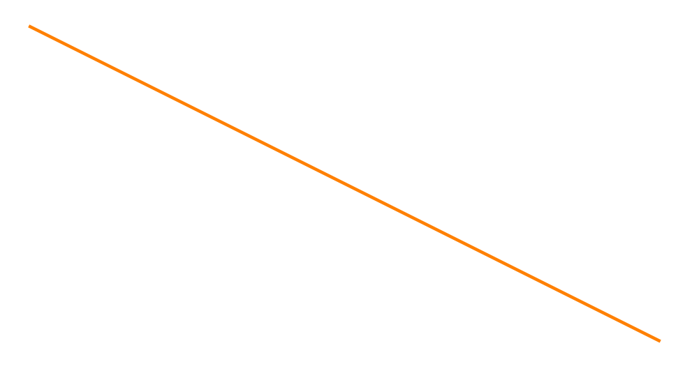
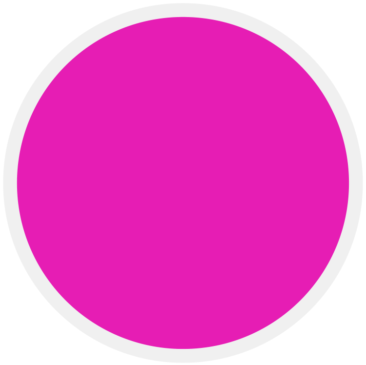
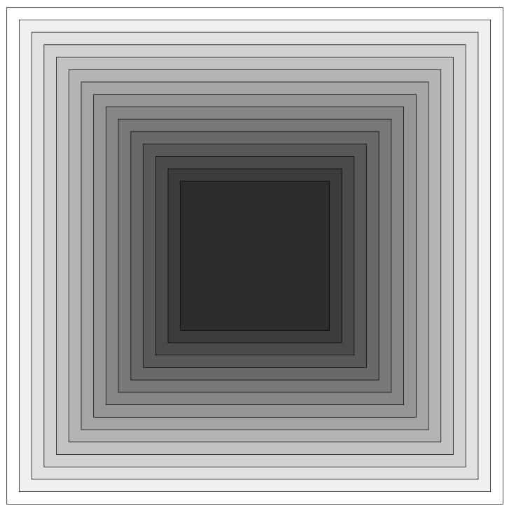
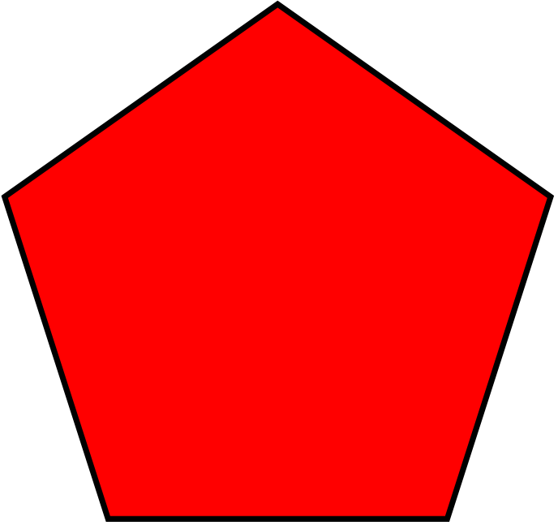
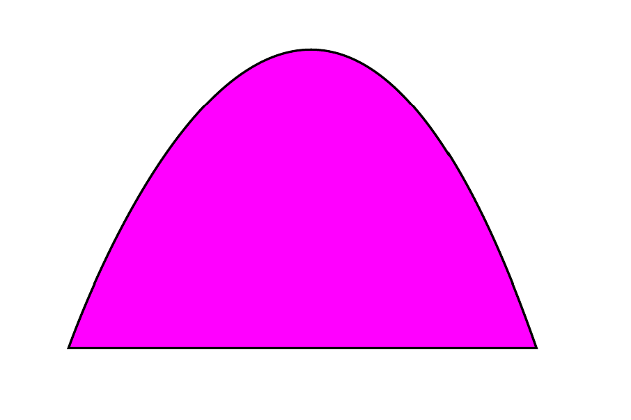
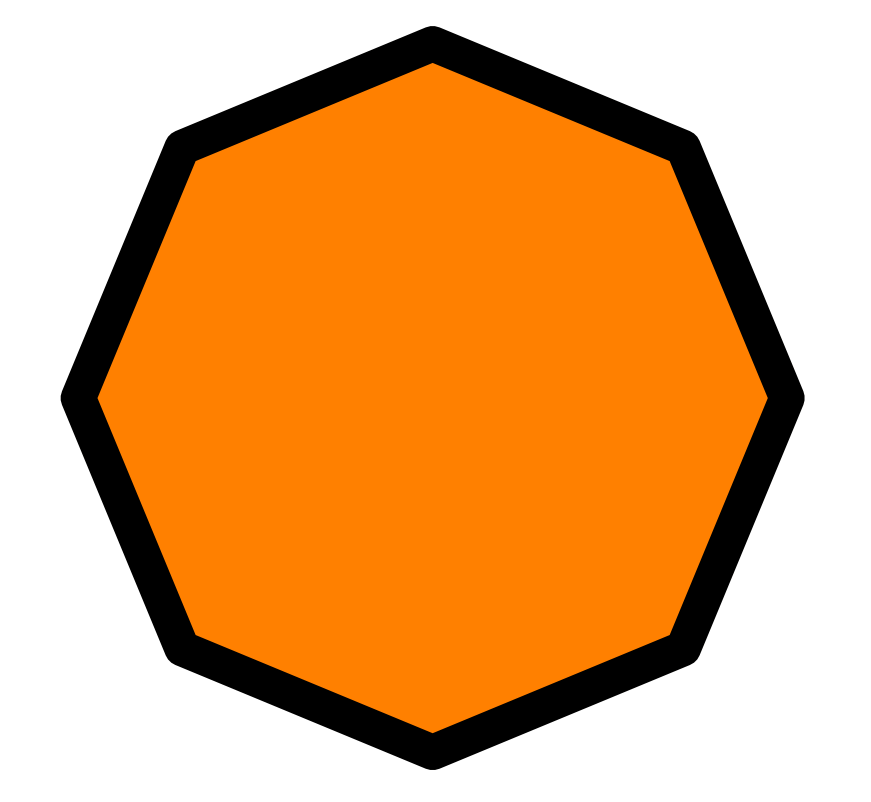

# Shapes #

The following code snippets show examples of rendering various shapes.

## Lines ##

Using [`line()`](fpdf/fpdf.html#fpdf.fpdf.FPDF.line) to draw a thin plain orange line:
```python
from fpdf import FPDF

pdf = FPDF()
pdf.add_page()
pdf.set_line_width(0.5)
pdf.set_draw_color(r=255, g=128, b=0)
pdf.line(x1=50, y1=50, x2=150, y2=100)
pdf.output("orange_plain_line.pdf")
```



Drawing a dashed light blue line:
```python
from fpdf import FPDF

pdf = FPDF()
pdf.add_page()
pdf.set_line_width(0.5)
pdf.set_draw_color(r=0, g=128, b=255)
pdf.set_dash_pattern(dash=2, gap=3)
pdf.line(x1=50, y1=50, x2=150, y2=100)
pdf.output("blue_dashed_line.pdf")
```


## Circle ##

Using [`circle()`](fpdf/fpdf.html#fpdf.fpdf.FPDF.circle) to draw a disc filled in pink with a grey outline:
```python
from fpdf import FPDF

pdf = FPDF()
pdf.add_page()
pdf.set_line_width(2)
pdf.set_draw_color(240)
pdf.set_fill_color(r=230, g=30, b=180)
pdf.circle(x=50, y=50, r=50, style="FD")
pdf.output("circle.pdf")
```


## Ellipse ##

Using [`ellipse()`](fpdf/fpdf.html#fpdf.fpdf.FPDF.ellipse), filled in grey with a pink outline:
```python
from fpdf import FPDF

pdf = FPDF()
pdf.add_page()
pdf.set_line_width(2)
pdf.set_draw_color(r=230, g=30, b=180)
pdf.set_fill_color(240)
pdf.ellipse(x=50, y=50, w=100, h=50, style="FD")
pdf.output("ellipse.pdf")
```


## Rectangle ##

Using [`rect()`](fpdf/fpdf.html#fpdf.fpdf.FPDF.rect) to draw nested squares:
```python
from fpdf import FPDF

pdf = FPDF()
pdf.add_page()
for i in range(15):
    pdf.set_fill_color(255 - 15*i)
    pdf.rect(x=5+5*i, y=5+5*i, w=200-10*i, h=200-10*i, style="FD")
pdf.output("squares.pdf")
```


Using [`rect()`](fpdf/fpdf.html#fpdf.fpdf.FPDF.rect) to draw rectangles with round corners:
```python
from fpdf import FPDF

pdf = FPDF()
pdf.add_page()
pdf.set_draw_color(200)
y = 10
pdf.rect(60, y, 33, 28, round_corners=True, style="D")

pdf.set_fill_color(0, 255, 0)
pdf.rect(100, y, 50, 10, round_corners=("BOTTOM_RIGHT"), style="DF")

pdf.set_fill_color(255, 255, 0)
pdf.rect(160, y, 10, 10, round_corners=("TOP_LEFT", "BOTTOM_LEFT"), style="F")
pdf.output("round_corners_rectangles.pdf")
```


## Polygon ##

Using [`polygon()`](fpdf/fpdf.html#fpdf.fpdf.FPDF.polygon):

```python
from fpdf import FPDF

pdf = FPDF()
pdf.add_page()
pdf.set_line_width(2)
pdf.set_fill_color(r=255, g=0, b=0)
coords = ((100, 0), (5, 69), (41, 181), (159, 181), (195, 69))
pdf.polygon(coords, style="DF")
pdf.output("polygon.pdf")
```


## Arc ##

Using [`arc()`](fpdf/fpdf.html#fpdf.fpdf.FPDF.arc):

```python
from fpdf import FPDF

pdf = FPDF()
pdf.add_page()
pdf.set_line_width(2)
pdf.set_fill_color(r=255, g=0, b=0)
pdf.arc(x=75, y=75, a=25, b=25, start_angle=90, end_angle=260, style="FD")

pdf.set_fill_color(r=255, g=0, b=255)
pdf.arc(x=105, y=75, a=25, b=50, start_angle=180, end_angle=360, style="FD")

pdf.set_fill_color(r=0, g=255, b=0)
pdf.arc(x=135, y=75, a=25, b=25, start_angle=0, end_angle=130, style="FD")

pdf.output("arc.pdf")
```


## Solid arc ##

Using [`solid_arc()`](fpdf/fpdf.html#fpdf.fpdf.FPDF.solid_arc):

```python
from fpdf import FPDF

pdf = FPDF()
pdf.add_page()
pdf.set_line_width(2)
pdf.set_fill_color(r=255, g=0, b=0)
pdf.solid_arc(x=75, y=75, a=25, b=25, start_angle=90, end_angle=260, style="FD")

pdf.set_fill_color(r=255, g=0, b=255)
pdf.solid_arc(x=105, y=75, a=25, b=50, start_angle=180, end_angle=360, style="FD")

pdf.set_fill_color(r=0, g=255, b=0)
pdf.solid_arc(x=135, y=75, a=25, b=25, start_angle=0, end_angle=130, style="FD")

pdf.output("solid_arc.pdf")
```


## Bezier Curve ##
Using [`bezier()`](fpdf/fpdf.html#fpdf.fpdf.FPDF.bezier) to create a cubic Bezier curve:
```python
from fpdf import FPDF
pdf = FPDF()
pdf.add_page()
pdf.set_fill_color(r=255, g=0, b=255)
pdf.bezier([(20, 80), (40, 20), (60, 80)])
pdf.output("bezier.pdf")
```



## Regular Polygon ##

Using [`regular_polygon()`](fpdf/fpdf.html#fpdf.fpdf.FPDF.regular_polygon):

```python
from fpdf import FPDF

pdf = FPDF()
pdf.add_page()
pdf.set_line_width(0.5)

pdf.set_fill_color(r=30, g=200, b=0)
pdf.regular_polygon(x=40, y=80, polyWidth=30, rotateDegrees=270, numSides=3, style="FD")

pdf.set_fill_color(r=10, g=30, b=255)
pdf.regular_polygon(x=80, y=80, polyWidth=30, rotateDegrees=135, numSides=4, style="FD")

pdf.set_fill_color(r=165, g=10, b=255)
pdf.regular_polygon(x=120, y=80, polyWidth=30, rotateDegrees=198, numSides=5, style="FD")

pdf.set_fill_color(r=255, g=125, b=10)
pdf.regular_polygon(x=160, y=80, polyWidth=30, rotateDegrees=270, numSides=6, style="FD")
pdf.output("regular_polygon.pdf")
```


## Regular Star ##

Using [`star()`](fpdf/fpdf.html#fpdf.fpdf.FPDF.star):

```python
from fpdf import FPDF

pdf = FPDF()
pdf.add_page()
pdf.set_line_width(0.5)

pdf.set_fill_color(r=255, g=0, b=0)
pdf.star(x=40, y=80, r_in=5, r_out=15, rotate_degrees=0, corners=3, style="FD")

pdf.set_fill_color(r=0, g=255, b=255)
pdf.star(x=80, y=80, r_in=5, r_out=15, rotate_degrees=90, corners=4, style="FD")

pdf.set_fill_color(r=255, g=255, b=0)
pdf.star(x=120, y=80, r_in=5, r_out=15, rotate_degrees=180, corners=5, style="FD")

pdf.set_fill_color(r=255, g=0, b=255)
pdf.star(x=160, y=80, r_in=5, r_out=15, rotate_degrees=270, corners=6, style="FD")
pdf.output("star.pdf")
```


## Path styling ##

* [`line_width`](fpdf/fpdf.html#fpdf.fpdf.FPDF.set_line_width)
  specifies the thickness of the line used to stroke a path

* [`stroke_join_style`](fpdf/enums.html#fpdf.enums.StrokeJoinStyle)
  defines how the corner joining two path components should be rendered:

```python
from fpdf import FPDF
from fpdf.enums import StrokeJoinStyle

pdf = FPDF()
pdf.add_page()
pdf.set_line_width(5)
pdf.set_fill_color(r=255, g=128, b=0)
with pdf.local_context(stroke_join_style=StrokeJoinStyle.ROUND):
    pdf.regular_polygon(x=50, y=120, polyWidth=100, numSides=8, style="FD")
pdf.output("regular_polygon_rounded.pdf")
```



* [`stroke_cap_style`](fpdf/enums.html#fpdf.enums.StrokeCapStyle)
  defines how the end of a stroke should be rendered.
  This affects the ends of the segments of dashed strokes, as well.

```python
from fpdf import FPDF
from fpdf.enums import StrokeCapStyle

pdf = FPDF()
pdf.add_page()
pdf.set_line_width(5)
pdf.set_fill_color(r=255, g=128, b=0)
with pdf.local_context(stroke_cap_style=StrokeCapStyle.ROUND):
    pdf.line(x1=50, y1=50, x2=150, y2=100)
pdf.output("line_with_round_ends.pdf")
```

There are even more specific path styling settings supported: [`dash_pattern`](fpdf/fpdf.html#fpdf.fpdf.FPDF.set_dash_pattern), `stroke_opacity`, `stroke_miter_limit`...

All of those settings can be set in a [`local_context()`](fpdf/fpdf.html#fpdf.fpdf.FPDF.local_context).
